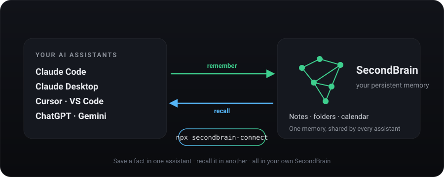
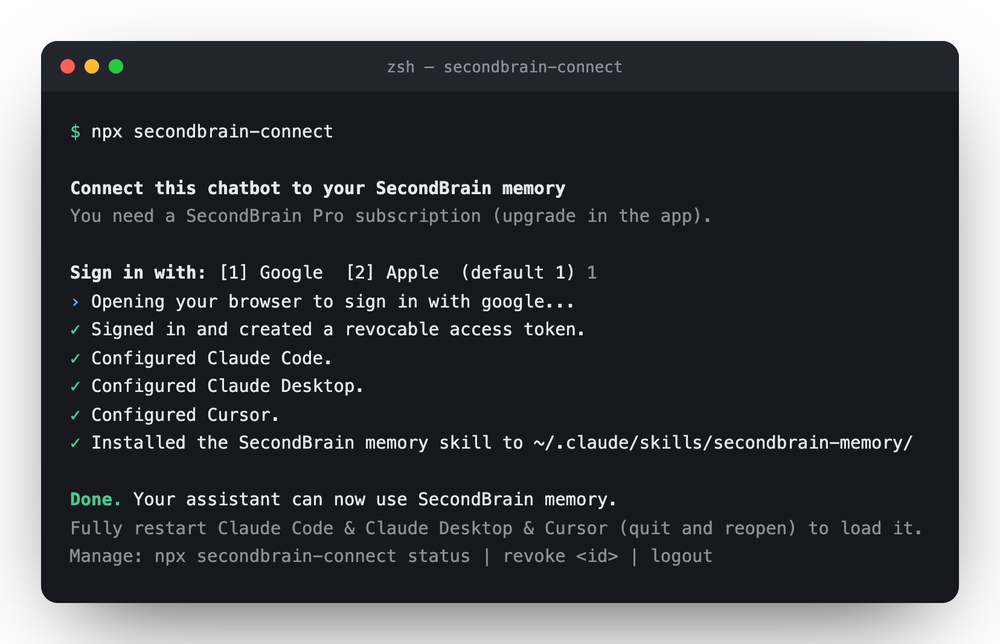
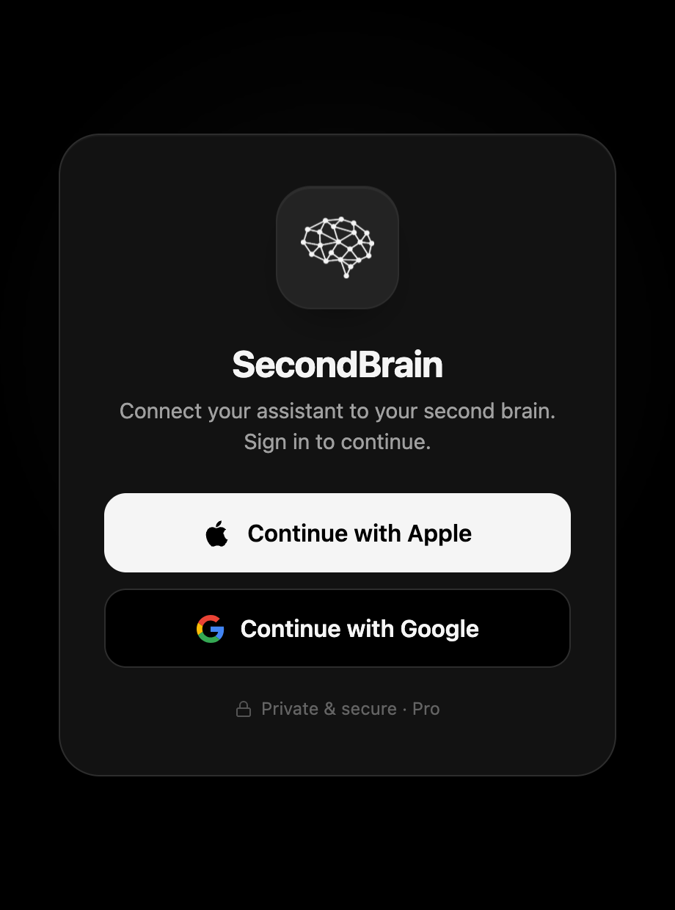

<div align="center">

<picture>
  <source media="(prefers-color-scheme: dark)" srcset="assets/brain-icon-light.png">
  
</picture>

# SecondBrain: una sola memoria per tutte le tue AI

**I tuoi assistenti AI dimenticano tutto appena chiudi la chat. SecondBrain dà loro una memoria.**

Diglielo una volta, e ogni assistente che usi se lo ricorda: nella chat dopo e anche il mese prossimo.

[🇬🇧 English](README.md) · [🇮🇹 Italiano](README.it.md) · [secondbrain.icu](https://secondbrain.icu)

<br>



</div>

---

## Cos'è?

Di solito la tua AI riparte da zero a ogni conversazione. Le rispieghi chi sei, a cosa stai lavorando, le tue preferenze. Ogni volta da capo.

**SecondBrain è una memoria condivisa per i tuoi assistenti.** Glielo dici una volta e resta lì: il tuo assistente se lo ricorda domani, la settimana prossima, e anche se passi a un'altra app di AI. Questa memoria sono semplicemente le tue note dentro l'app SecondBrain. Quindi è privata, è tua, e la puoi leggere o modificare quando vuoi dal telefono.

<div align="center">

<table>
<tr>
<td align="center" width="25%"><br><sub>Parlaci e basta</sub></td>
<td align="center" width="25%"><br><sub>Scrive lui la nota</sub></td>
<td align="center" width="25%"><br><sub>La archivia per te</sub></td>
<td align="center" width="25%"><br><sub>E anche promemoria</sub></td>
</tr>
</table>

</div>

---

## L'app SecondBrain

SecondBrain è la tua app di memoria personale, per iPhone e Android. Parla o scrivi: trasforma quello che dici in note ordinate, le sistema da sola nelle cartelle giuste e tiene tutto a portata di ricerca in un unico posto. La memoria condivisa che usano i tuoi assistenti AI è costruita su queste stesse note, quindi quello che salvi nell'app e quello che salva il tuo assistente stanno insieme.

Scarica l'app: **[App Store (iPhone)](https://apps.apple.com/app/id6762130376)** · **[Google Play (Android)](https://play.google.com/store/apps/details?id=app.secondbrain.android)**.

---

## Promemoria e calendario

Il tuo assistente non si limita a ricordare informazioni. Chiedigli di ricordarti qualcosa o di aggiungere un evento, e lo trovi subito nell'app SecondBrain, accanto alle tue note. Per esempio:

- *"Ricordami di chiamare il dentista domani alle 10."*
- *"Metti un pranzo con Anna venerdì all'una."*

Promemoria e calendario restano insieme alla tua memoria, in un unico posto ordinato.

---

## Cosa ti serve

1. **L'app SecondBrain, con Pro.** La memoria fa parte di Pro. Scarica l'app e attiva Pro al suo interno: [secondbrain.icu](https://secondbrain.icu).
2. **Un computer** (Windows, Mac o Linux) per lanciare un comando, una volta sola.

Tutto qui. Niente account da collegare, niente impostazioni da copiare. Fa tutto la procedura qui sotto.

---

## Installazione in 3 passi

### Passo 1: Installa Node.js

La procedura usa uno strumento gratuito che si chiama **Node.js**. Si installa in un paio di minuti e lo fai una volta sola.

- Vai su **[nodejs.org/en/download](https://nodejs.org/en/download)**, scarica la versione **LTS** per il tuo sistema e avvia l'installazione (clicca Avanti fino alla fine).
- Ti serve una mano? Segui la guida passo passo per il tuo sistema qui: **[Installa Node.js](docs/install-node.md)** (in inglese).

> Ce l'hai già? Salta pure questo passo. (Se non sei sicuro, vai avanti lo stesso: te lo dirà.)

### Passo 2: Lancia il comando

Apri un **terminale** sul computer:

- **Windows:** premi il tasto Windows, scrivi **PowerShell**, premi Invio.
- **Mac:** premi Cmd + Spazio, scrivi **Terminale**, premi Invio.
- **Linux:** apri la tua app **Terminale**.

Scrivi questo e premi Invio:

```bash
npx secondbrain-connect
```

Si apre il browser. **Accedi con Google o Apple.** Questa è tutta l'installazione: nessuna password o codice da copiare.

<div align="center">

<br><br>

<br><sub>La schermata di accesso che si apre nel browser.</sub>
</div>

### Passo 3: Riavvia la tua app di AI

**Chiudi del tutto e riapri** il tuo assistente (chiudi l'app intera, non solo la finestra). Fatto.

> **Prova:** di' al tuo assistente *"Ricorda che il mio colore preferito è il verde acqua."* Poi apri una nuova chat e chiedi *"Qual è il mio colore preferito?"* Se lo sa, la memoria funziona. 🎉

---

## Installa la skill

La skill insegna al tuo assistente *quando* ricordare e richiamare, così la memoria diventa automatica. Ogni strumento tiene le skill in una sua cartella, quindi scegli il tuo qui sotto. (Per Claude la installa già `npx secondbrain-connect`.)

**Claude Code.** Chiediglielo e basta: *"Installa la skill da https://github.com/fed3c3sa/secondbrain-shared-memory in ~/.claude/skills."* Oppure lancia una riga e avvia una nuova sessione:

```bash
mkdir -p ~/.claude/skills/secondbrain-memory && curl -fsSL https://raw.githubusercontent.com/fed3c3sa/secondbrain-shared-memory/main/skill/secondbrain-memory/SKILL.md -o ~/.claude/skills/secondbrain-memory/SKILL.md
```

**Cursor.** Cursor legge anche `~/.claude/skills/`, quindi la riga qui sopra lo copre già. Per aggiungerla a un solo progetto, mettila in `.cursor/skills/` e ricarica la finestra (Cmd/Ctrl+Shift+P, "Developer: Reload Window"):

```bash
mkdir -p .cursor/skills/secondbrain-memory && curl -fsSL https://raw.githubusercontent.com/fed3c3sa/secondbrain-shared-memory/main/skill/secondbrain-memory/SKILL.md -o .cursor/skills/secondbrain-memory/SKILL.md
```

**Codex.** Lancia una riga, poi controlla con `/skills`:

```bash
mkdir -p ~/.agents/skills/secondbrain-memory && curl -fsSL https://raw.githubusercontent.com/fed3c3sa/secondbrain-shared-memory/main/skill/secondbrain-memory/SKILL.md -o ~/.agents/skills/secondbrain-memory/SKILL.md
```

**Claude Desktop.** Scarica **[secondbrain-memory.zip](https://github.com/fed3c3sa/secondbrain-shared-memory/raw/main/skill/secondbrain-memory.zip)**, poi nell'app apri **Impostazioni → Capabilities → Skills**, carica lo zip e attivalo.

**Qualsiasi altra app con le skill.** Metti lo stesso `SKILL.md` nella sua cartella delle skill (le più comuni leggono `.agents/skills/` o `~/.agents/skills/`).

> **Su Windows**, usa le stesse cartelle nella tua home utente, per esempio `%USERPROFILE%\.claude\skills\secondbrain-memory\SKILL.md`, e salva lì il file [SKILL.md](skill/secondbrain-memory/SKILL.md).

---

## Funziona con

Claude (Desktop e Code), Cursor e altre app di AI. Il comando configura da solo tutto quello che trova sul tuo computer. Hai un nuovo dispositivo? Lancia il comando anche lì: la memoria è la stessa ovunque.

---

## Come gestirla

```bash
npx secondbrain-connect status        # vedi cosa è collegato
npx secondbrain-connect revoke --all  # scollega tutto
```

---

## Hai bisogno di aiuto?

- **Dice che ti serve Pro?** Apri l'app SecondBrain e attiva Pro (è l'unico posto dove farlo), poi rilancia il comando.
- **L'accesso con Apple non ha funzionato?** Usa Google: `npx secondbrain-connect --google`.
- **`npx` non trovato?** Node.js non è ancora installato, vedi il [Passo 1](#passo-1-installa-nodejs).
- **Il tuo assistente non si ricorda?** Chiudi del tutto e riapri l'app.

Altre soluzioni: **[Risoluzione problemi](docs/troubleshooting.md)** (in inglese).

---

## Domande frequenti

**È gratis?** L'app è gratuita. La memoria condivisa fa parte di Pro.

**I miei dati sono privati?** Sì. La memoria sono le tue note, nel tuo account. Solo l'assistente che colleghi può usarla, e lo puoi scollegare quando vuoi.

**Devo usare il terminale tutti i giorni?** No. Lanci il comando una volta sola per collegarti. Dopo, la memoria funziona da sola dentro il tuo assistente.

---

<div align="center">

Fatto con 🧠 da **SecondBrain** · [secondbrain.icu](https://secondbrain.icu)

</div>
