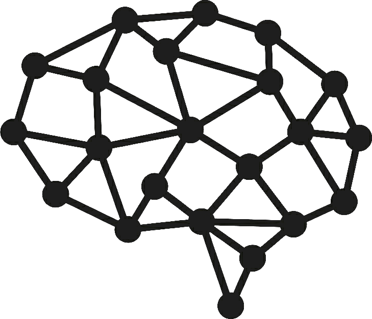
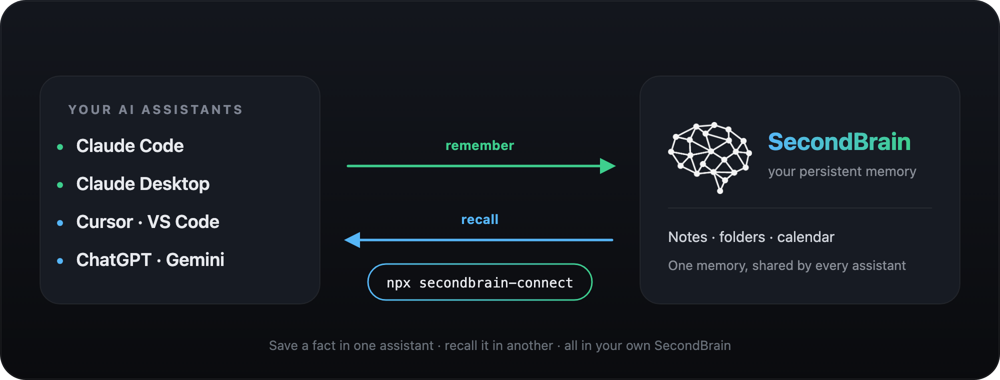
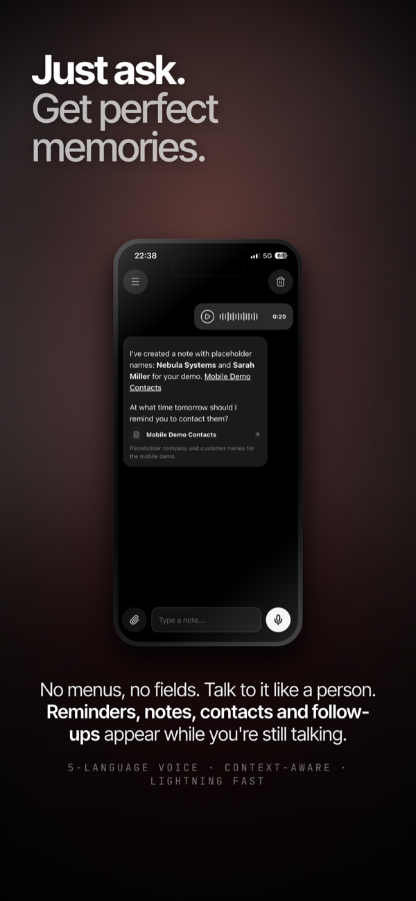
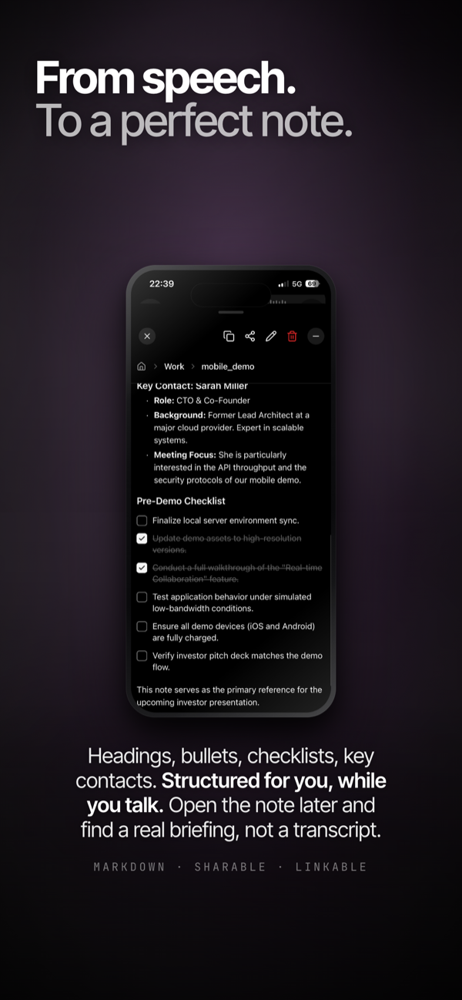
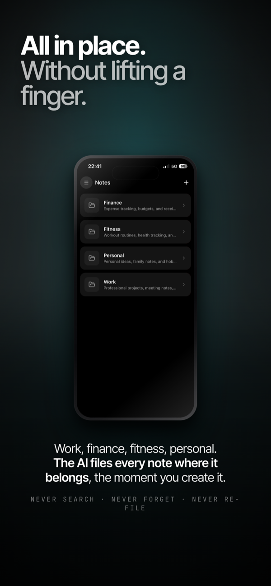
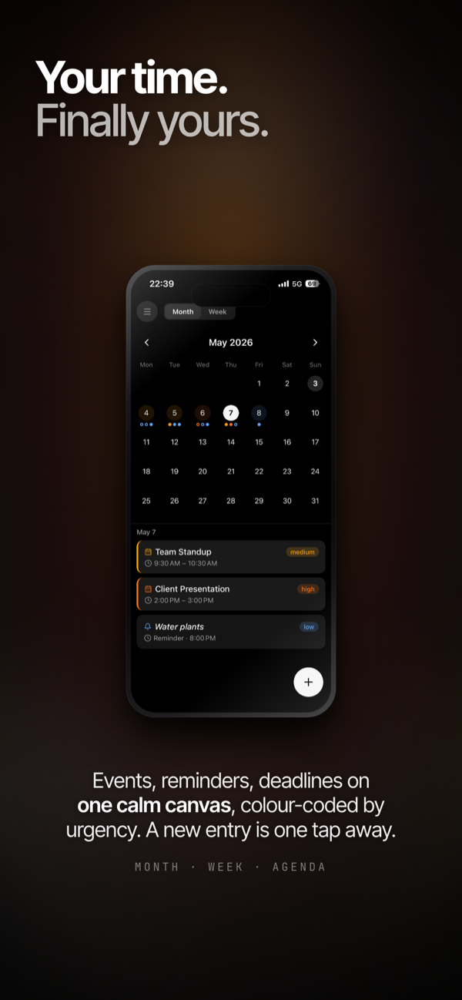

<div align="center">

<picture>
  <source media="(prefers-color-scheme: dark)" srcset="assets/brain-icon-light.png">
  
</picture>

# SecondBrain: una sola memoria per tutte le tue AI

**La tua AI dimentica tutto appena chiudi la chat. SecondBrain le dà una memoria.**

Diglielo una volta e ogni assistente che usi se lo ricorda, nella chat dopo e il mese prossimo.

[🇬🇧 English](README.md) · [🇮🇹 Italiano](README.it.md) · [secondbrainmemory.com](https://secondbrainmemory.com)

<br>



</div>

---

## Cos'è?

Di solito la tua AI riparte da zero a ogni conversazione: le rispieghi chi sei, a cosa stai lavorando, le tue preferenze. Ogni volta da capo.

**SecondBrain è una memoria condivisa per i tuoi assistenti.** Glielo dici una volta e resta: il tuo assistente se lo ricorda domani, la settimana prossima, e anche se passi a un'altra app di AI. La memoria sono semplicemente le tue note nell'app SecondBrain: privata, tua, leggibile e modificabile quando vuoi dal telefono.

<div align="center">

<table>
<tr>
<td align="center" width="25%"><br><sub>Parlaci e basta</sub></td>
<td align="center" width="25%"><br><sub>Scrive lui la nota</sub></td>
<td align="center" width="25%"><br><sub>La archivia per te</sub></td>
<td align="center" width="25%"><br><sub>E anche promemoria</sub></td>
</tr>
</table>

</div>

Gestisce anche **promemoria e calendario**: chiedi *"ricordami di chiamare il dentista domani alle 10"* e lo trovi nell'app, accanto alle tue note.

Scarica l'app: **[App Store (iPhone)](https://apps.apple.com/app/id6762130376)** · **[Google Play (Android)](https://play.google.com/store/apps/details?id=app.secondbrain.android)**

---

## Collega la tua AI con un solo accesso

> ✅ Accedi con **Apple** o **Google**, entrambi pienamente supportati. Usa lo **stesso account che usi nell'app SecondBrain**, così il tuo assistente trova le tue note.

Due passi, una volta sola:

1. **Scarica l'app e attiva Pro** su [secondbrainmemory.com](https://secondbrainmemory.com). La memoria fa parte di Pro.
2. **Collega il tuo assistente**. Trova la tua app qui sotto. Accedi **una volta dal browser**: dopo, la tua AI ricorda ovunque, per sempre.

### Usi Claude Code?

Tre comandi nel terminale. Lanciali uno alla volta:

```bash
claude plugin marketplace add fed3c3sa/secondbrain-shared-memory
claude plugin install secondbrain@secondbrain --scope user
npx secondbrain-connect
```

L'ultimo comando apre il browser. Clicca **Continua con Apple** o **Continua con Google**, usando lo stesso account dell'app SecondBrain. È l'unica cosa che fai a mano. Non copi mai un token, un link o del JSON.

Poi chiudi del tutto Claude Code e riaprilo.

**Ancora più semplice:** chiedi a Claude Code di farlo per te. Incolla questo in chat:

> *Installa il plugin SecondBrain da https://github.com/fed3c3sa/secondbrain-shared-memory*

Conosce questi comandi e li esegue da solo.

**Su Windows:** gli stessi tre comandi funzionano in PowerShell o CMD. Se vedi `npx is not recognized`, installa [Node.js](docs/install-node.md), apri un terminale **nuovo** e rilancia l'ultimo comando.

#### Controlla che funzioni

```bash
claude mcp get secondbrain
```

Devi vedere `Status: ✔ Connected`. Per controllare anche il plugin:

```bash
claude plugin list
```

`secondbrain` deve comparire nella lista. Se c'è ma è spento, lancia `claude plugin enable secondbrain@secondbrain`.

#### Cosa hai appena fatto

- **Marketplace:** hai detto a Claude Code dove trovare il plugin.
- **Plugin:** hai installato la skill della memoria, più un promemoria che ricorda a Claude di usarla da solo.
- **`npx secondbrain-connect`:** ti ha fatto accedere e ha scritto la connessione dentro Claude Code, Claude Desktop e Cursor al posto tuo.
- **Token di accesso:** creato e salvato per te. Non lo vedi e non lo digiti mai.

### Usi ChatGPT?

Fallo su **chatgpt.com dal browser**, una volta sola. Poi funziona anche nell'app ChatGPT
per desktop, perché la connessione appartiene al tuo account ChatGPT. Serve un piano
ChatGPT a pagamento.

1. **Impostazioni → Sicurezza e accesso → Modalità sviluppatore**, attivala. (Nelle
   versioni più vecchie sta in **Impostazioni → App → Avanzate**.)
2. Vai su **Plugin** e premi **"+"**. Chiamalo `SecondBrain`, mettici una descrizione
   qualsiasi e sotto **Connessione** inserisci l'URL del server MCP:
   `https://mcp.secondbrainmemory.com/mcp`
3. Crea la connessione, poi premi **Connect** e accedi con **Apple o Google**, lo stesso
   account dell'app SecondBrain. A fine setup ChatGPT elenca i 12 strumenti della memoria.

Poi chiudi del tutto ChatGPT e riaprilo.

> **Perché non il plugin?** La chat di ChatGPT prende i suoi strumenti dai *connettori*
> del tuo account, non da un plugin installato da un marketplace. Installare il nostro
> plugin in ChatGPT gli dà la *skill* della memoria, ma nessuno strumento: l'assistente
> dirà che vede SecondBrain ma non ha con cosa interrogarlo. È il connettore qui sopra a
> collegarlo davvero.

**Usi Codex** (la CLI `codex`, o il lato Codex dell'app ChatGPT)? Quello sì che esegue il
plugin, dallo stesso marketplace di Claude:

```bash
codex plugin marketplace add fed3c3sa/secondbrain-shared-memory
codex plugin add secondbrain@secondbrain
codex mcp login secondbrain
```

L'ultimo comando apre il browser per l'accesso con Apple o Google. **Non saltarlo:** i
primi due installano il plugin ma lasciano la memoria *scollegata*. Controlla con
`codex mcp list`: la riga `secondbrain` deve dire `Auth: OAuth`.

### Usi Cowork o Claude Desktop?

1. Scarica **[secondbrain-plugin.zip](https://github.com/fed3c3sa/secondbrain-shared-memory/raw/main/dist/secondbrain-plugin.zip)** (dalla cartella [`dist/`](dist/)).
2. Importalo nell'app.
3. Accedi una volta: **Settings → Connectors → SecondBrain → Connect** (su Cowork: **Customize → Connectors**) → accedi con **Apple o Google**.

### Usi altro? Un comando

Per Cursor, Gemini e altre app, lancia questo una volta (serve [Node.js](docs/install-node.md)), accedi con Apple o Google dal browser, poi riavvia l'app:

```bash
npx secondbrain-connect
```

Configura da solo ogni assistente sul tuo computer e installa la skill della memoria.

> **Prova:** di' *"Ricorda che il mio colore preferito è il verde acqua."* Poi, in una chat nuova, chiedi *"Qual è il mio colore preferito?"* Se lo sa, è tutto a posto. 🎉

---

## Come gestirla

```bash
npx secondbrain-connect status        # vedi cosa è collegato
npx secondbrain-connect revoke --all  # scollega tutto
```

---

## Hai bisogno di aiuto?

- **Dice che serve Pro?** Attiva Pro nell'app SecondBrain, poi riprova.
- **Hai visto `Dynamic Client Registration rejected (HTTP 404)`?** Era un nostro bug, non un tuo errore, ed è **risolto**: la memoria ora sta su `https://mcp.secondbrainmemory.com/mcp`, che espone i documenti di discovery OAuth dove le specifiche dicono che devono stare. Reinstalla il plugin (o punta la connessione a quell'URL) e l'accesso interno di Claude Code funziona. `npx secondbrain-connect` continua a funzionare.
- **ChatGPT dice che vede SecondBrain ma non ha strumenti per interrogarlo?** È il plugin senza il connettore. La chat di ChatGPT prende gli strumenti solo dai connettori: aggiungi il connettore personalizzato qui sopra, poi riavvia ChatGPT.
- **L'hai installato su Codex e non succede niente?** Il plugin installa la memoria ma non fa l'accesso. Lancia `codex mcp login secondbrain`, controlla che `codex mcp list` dica `Auth: OAuth`, poi riavvia.
- **Gli strumenti dicono `not_authenticated`?** Lancia `npx secondbrain-connect`, poi chiudi del tutto e riapri l'app.
- **L'accesso non si è aperto?** Prova `npx secondbrain-connect --google`, oppure incolla nel browser il link che stampa.
- **`npx` non trovato?** Installa Node.js ([guida](docs/install-node.md)), poi apri un terminale nuovo.
- **Non ricorda?** Chiudi del tutto e riapri l'app (e su Claude web, controlla che il connettore SecondBrain risulti **Connected**).

Altre soluzioni: **[Risoluzione problemi](docs/troubleshooting.md)** (in inglese).

---

## Domande frequenti

**È gratis?** L'app è gratuita. La memoria condivisa fa parte di Pro.

**I miei dati sono privati?** Sì, la memoria sono le tue note, nel tuo account. Solo l'assistente che colleghi può usarla, e lo scolleghi quando vuoi.

**Con quale account posso accedere?** Apple o Google, funzionano entrambi, ovunque. Usa lo stesso con cui ti sei registrato nell'app SecondBrain.

**Devo accedere ogni volta?** No. Un solo accesso dal browser, poi funziona e basta.

---

## Avanzate

- **Plugin Claude, guida completa** (accesso per ogni app, zip offline, troubleshooting): [docs/plugin.md](docs/plugin.md) (in inglese)
- **Aggiungere la connessione a mano** (qualsiasi app con MCP remoto): puntala su `https://mcp.secondbrainmemory.com/mcp` (transport `http`) e accedi dal browser quando richiesto.
- **Installare solo la skill** (senza plugin): metti [`skill/secondbrain-memory/SKILL.md`](skill/secondbrain-memory/SKILL.md) nella cartella skill del tuo strumento (es. `~/.claude/skills/`), oppure carica [secondbrain-memory.zip](https://github.com/fed3c3sa/secondbrain-shared-memory/raw/main/skill/secondbrain-memory.zip) in Claude Desktop (**Settings → Capabilities → Skills**).

---

<div align="center">

Fatto con 🧠 da **SecondBrain** · [secondbrainmemory.com](https://secondbrainmemory.com)

</div>
